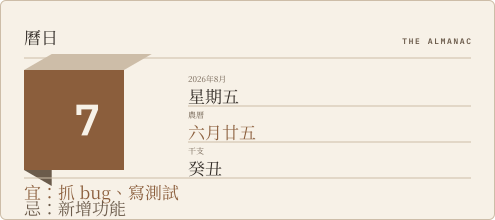

<h1 align="center">Readme-Atelier</h1>

<p align="center">為你的 GitHub 個人檔案 README 產生卡片。<br>
一份設定檔、一個 Action——不用 fork、不用架伺服器、不用寫程式碼。</p>

<p align="center">
  <sub>繁體中文 · <a href="README.md">English</a></sub>
</p>

<p align="center">
  <picture>
    <source media="(prefers-color-scheme: dark)" srcset="docs/preview-dark.svg">
    
  </picture>
</p>

<p align="center"><sub>曆日 Almanac ・ 淺色／深色跟著讀者的系統佈景切換</sub></p>

每張卡片都是獨立的 SVG 檔案，你可以只嵌入想要的那一張，也可以五張全上。GitHub Action 會依排程
渲染所有啟用的卡片，並發布到你自己 repository 的 `output` 分支。整個流程不在讀者瀏覽頁面時執行，
所以不存在一個「它掛掉你的 README 就跟著壞掉」的外部服務。

## 目錄現況

<sub>下面這排不是截圖，是這個 repo 對自己跑出來的即時輸出。每 6 小時由
<a href="https://github.com/WayneLY-Chen/Readme-Atelier/actions"><code>cards.yml</code></a>
重新算繪並發布到 <a href="https://github.com/WayneLY-Chen/Readme-Atelier/tree/output"><code>output</code></a>
分支，經 <code>raw.githubusercontent.com</code> 送到這裡——也就是任何人嵌進自己 README 時走的
同一條路徑，不是 GitHub 的 camo 圖片代理。</sub>

<p align="center">
  <picture>
    <source media="(prefers-color-scheme: dark)" srcset="https://raw.githubusercontent.com/WayneLY-Chen/Readme-Atelier/output/the-record-dark.svg?v=2">
    
  </picture>
</p>

<p align="center"><sub>唱片 The Record ・ 唯一會動的一張。若你的系統開啟了「減少動態效果」，它會靜止——這是刻意的。</sub></p>

<p align="center">
  <picture>
    <source media="(prefers-color-scheme: dark)" srcset="https://raw.githubusercontent.com/WayneLY-Chen/Readme-Atelier/output/masthead-dark.svg?v=2">
    
  </picture>
  <picture>
    <source media="(prefers-color-scheme: dark)" srcset="https://raw.githubusercontent.com/WayneLY-Chen/Readme-Atelier/output/editorial-stat-card-dark.svg?v=2">
    
  </picture>
  <picture>
    <source media="(prefers-color-scheme: dark)" srcset="https://raw.githubusercontent.com/WayneLY-Chen/Readme-Atelier/output/the-graveyard-dark.svg?v=2">
    
  </picture>
</p>

## 五分鐘採用

四個步驟，不用 fork、不用寫程式碼。[Playground](https://waynely-chen.github.io/Readme-Atelier/)
會替你產生步驟 1 與步驟 2——打上你的使用者名稱、勾選卡片，複製結果即可。這份 walkthrough
是給想先讀懂再動手、或想弄清楚自己貼了什麼的人看的。

**1.** 在你 GitHub 帳號同名的那個 repository（你的 profile repository）裡，存成
`.github/workflows/readme-atelier.yml`：

```yaml
name: readme-atelier
on:
  schedule:
    - cron: "0 */6 * * *"   # 預設 6 小時一次；改這行即可調整頻率
  workflow_dispatch:          # 讓你可以手動觸發第一次
permissions:
  contents: write             # 必要——若這個 repo 屬於某個組織，請見下方「組織 Repository」
jobs:
  render:
    uses: WayneLY-Chen/Readme-Atelier/.github/workflows/render.yml@v1
```

**2.** 在同一個 repository 的根目錄加上 `widgets.yml`：

```yaml
language: zh-TW
timezone: Asia/Taipei

cards:
  - type: almanac
```

**3.** 到 **Actions** 分頁手動跑一次 `readme-atelier`（`workflow_dispatch` 按鈕）——不用等排程輪到。

**4.** 打開這次執行的 job summary。每張啟用的卡片都會印出可以直接貼上的 `<picture>` 片段，
複製進你的 README：

```html
<picture>
  <source media="(prefers-color-scheme: dark)" srcset="https://raw.githubusercontent.com/<你>/<你的repo>/output/almanac-dark.svg?v=1">
  /<你的repo>/output/almanac-light.svg?v=1"
       alt="曆日卡片：顯示今日西曆日期、農曆月日、干支紀日，以及開發者宜／忌建議。">
</picture>
```

這樣就完成了。結尾的 `?v=1` 是手動的快取破壞器——任何時候想繞過快取強制刷新，把它遞增就好，
不論是你自己還是讀者的瀏覽器快取。

## 試玩 Playground

[**Playground**](https://waynely-chen.github.io/Readme-Atelier/) 在你的瀏覽器裡即時渲染每一張
卡片，用的是這個 repo 出貨到正式環境的同一支渲染程式碼，不是示意圖。挑一個主題與語言、打上任意
使用者名稱，它會一次給你三份採用素材：步驟 1 的 workflow 檔、對應的 `widgets.yml`，以及步驟 4
的 `<picture>` 嵌入片段——與 Action 本身印出的是同一種片段形狀，不用推送任何東西、也不用等執行
跑完。

## 卡片

| 名稱 | 內容 | 需要 GitHub 資料 |
|---|---|---|
| `almanac` | 今日西曆日期、農曆月日、干支紀日，以及依建除十二神推算的開發者宜／忌 | 否 |
| `editorial-stat-card` | 提交、PR、議題、星標、追蹤者五個統計數字，雜誌排版風格 | 是 |
| `the-graveyard` | 久未推送的儲存庫，以墓碑呈現存活天數 | 是 |
| `the-record` | 把今年到目前為止的貢獻壓成一張黑膠唱片——每圈溝紋代表一週，越忙越粗，唱針停在本週；唯一會動的卡片 | 是 |
| `masthead` | 報頭樣式的標題列，列出其他啟用卡片的目次與一則引用數據 | 是 |

目錄會持續增加——見[貢獻](#貢獻)。

## 設定

`widgets.yml` 是你唯一需要修改的檔案。所有欄位都可以省略；整份檔案刪掉也能跑，此時會套用內建
預設值，並把一份等價設定完整印在執行 log 裡，讓你有東西可以直接複製著改。

| 欄位 | 可用值 | 預設 |
|---|---|---|
| `theme` | `editorial`、`dracula`、`nord`、`tokyonight` | `editorial` |
| `language` | `en`、`zh-TW` | `en` |
| `timezone` | 任何 IANA 時區名，例如 `Asia/Taipei` | `UTC` |
| `cards[].type` | 卡片名稱 | 必填 |
| `cards[].id` | 小寫英文字母、數字、連字號 | 未填則沿用 `type` |
| `cards[].options` | 各卡片自己的選項 | — |

`language` 只在最上層——不接受卡片層級覆寫，也不會從你的帳號自動推論；在某張卡片的 `options`
裡寫 `language` 會直接讓執行失敗，而不是被默默忽略。`id` 決定輸出檔名
（`<id>-light.svg` / `<id>-dark.svg`），只允許小寫——重複偵測區分大小寫，但在 Windows 與預設
設定的 macOS 上，`Foo-light.svg` 和 `foo-light.svg` 是同一個檔案，強制小寫讓這種碰撞根本無法
表達出來。設定寫錯會讓整次執行失敗，**一次列出所有問題**，附上行號與建議，驗證失敗時不會寫出
任何檔案——不會留下半套更新看起來像是成功了。

**[完整設定說明](docs/configuration.md)**——每張卡片自己的選項、驗證錯誤的確切格式、Action
參數細節——維持繁體中文撰寫；上面這張表就是本專案英文版對同一批欄位的完整覆蓋。

## 組織 Repository

**權限設對了，不代表需要即時資料的卡片就會動。** 權限只管**發布**——把渲染好的卡片推到
`output` 分支；那是完全獨立於**取資料**這一步的另一件事。預設情況下，取資料查的是這個 repo
的擁有者，而 GitHub 的 GraphQL API 只能查得到**使用者（User）**的 profile，查不到**組織
（Organization）**的。組織擁有的 repository，owner 本身就是組織，所以除了 `almanac`（唯一
零 API 呼叫的卡片）以外的每一張卡，即使權限設定完全正確，還是會失敗：

> ✗ Failed to fetch live profile data from GitHub's GraphQL API
>   Could not resolve to a User with the login of '\<你的組織名稱\>'.
>   ...

修法是加上選用的 `profile-login` input，指名卡片實際上要顯示**誰**（一個真人帳號）的 profile：

```yaml
jobs:
  render:
    uses: WayneLY-Chen/Readme-Atelier/.github/workflows/render.yml@v1
    with:
      profile-login: <你的 GitHub 使用者名稱>
```

個人 repo 完全不需要這個——repo 擁有者本身就是對的帳號，不設 `profile-login` 就是維持過去
的行為，不受影響。

另外一件事：新建立的組織擁有 repository，常把預設的 `GITHUB_TOKEN` 權限設成唯讀，這會擋住
**發布**這一步——即使上面的 profile-login 已經處理好了也一樣。這個預設是**起點，不是
上限**——GitHub 官方文件原文這麼寫：*「If the default permissions for the `GITHUB_TOKEN` are
restrictive, you may have to elevate the permissions to allow some actions and commands to
run successfully.」*（若 `GITHUB_TOKEN` 的預設權限太嚴格，你可能需要自行拉高權限，好讓某些
actions 和指令能順利執行。）步驟 1 的範本正是這麼做的——在你自己的 workflow 檔裡宣告
`permissions: contents: write`：權限鏈只能被呼叫端的 workflow **降級**，不能拉高，所以這行必須
寫在**你自己的檔案**裡，寫在 `render.yml` 裡沒有用。

如果照做之後 publish 仍然失敗，真正的硬牆通常是組織的 **allowed-actions 政策**（Settings →
Actions → General → Policies）：設成「Allow select actions and reusable workflows」時，組織管理
員必須把 `WayneLY-Chen/Readme-Atelier` 加入允許清單。組織也可能整個停用 Actions。

若單純漏寫 `permissions: contents: write`，執行會失敗，Action 自己的錯誤訊息會指名修法：

> Failed to publish to the output branch: [...]. If this is an org-owned repository, an admin may
> need to allow Settings → Actions → General → Workflow permissions → Read and write permissions.

## 排程可靠度

GitHub 官方原文：*「In a public repository, scheduled workflows are automatically disabled when
no repository activity has occurred in 60 days.」*（公開 repository 若連續 60 天沒有任何活動，
排程工作流程會被自動停用。）卡片突然不再更新，通常就是這個原因。官方記載的三種補救：Actions
分頁的 **Enable workflow** 按鈕、手動跑一次 `workflow_dispatch`，或單純對這個 repository 推送
任何一個 commit——以上任一動作都會重置時鐘。

排程只會在你 repository 的**預設分支**上觸發，而且 GitHub 明確表示高負載時「some queued jobs
may be dropped」（部分排入佇列的工作可能會被丟棄）——所以步驟 1 的 6 小時 cron 是頻率期望，不是
精準保證的時刻表。失敗通知會寄給最後修改該 workflow 檔案 cron 語法的人；因為那份檔案在**你自己**
的 repository 裡，收件人就是你。

**本專案不出貨任何 auto-commit 的 keepalive bot。** 如果你仍想要一個，官方文件記載的可行模式是：
在你帳號的其他地方另設一個不相關的排程 workflow，在 60 天窗口關閉前做一次無意義的 commit——這是
你自己刻意做的決定，不是本專案替你做的事。Action 內每一條失敗路徑都會呼叫 `core.setFailed`，
所以壞掉的執行永遠會在 Actions 分頁顯示紅燈並寄信通知擁有者——絕不會靜默失敗。

## 補充事項

- **交付路徑是 `raw.githubusercontent.com`**，GitHub 自己的網域，不是 GitHub 給第三方圖床用的
  camo 圖片代理。真正決定動畫與樣式能不能存活的是它的 Content-Security-Policy
  （`default-src 'none'; style-src 'unsafe-inline'; sandbox`）——已對 The Record 的真實渲染
  結果驗證過。
- **淺色與深色是兩個檔案。** SVG 內部的 `prefers-color-scheme` 一旦被代理就不可靠，所以每張卡片
  成對輸出，由 `<picture>` 負責切換。
- **文字全部轉成路徑。** 以圖片形式載入的 SVG 無法載入字型，所以字符在渲染當下就嵌成路徑資料，
  代價是檔案大一些（每張約 80KB，上限 200KB）。
- **無障礙。** SVG 被當成圖片引用時，只有 `` 會傳到輔助科技——寫在 SVG 裡的 `<title>`
  永遠不會。產生的片段帶有真正描述卡片內容的 alt 文字，貼上時請保留它。
- **私人貢獻永遠看不到**，不論 `GITHUB_TOKEN` 被授予什麼權限範圍——GitHub 的 GraphQL API 不會透過
  `contributionsCollection` 揭露私人貢獻的實際內容，即使 token 屬於帳號本人也一樣。這是 API 本身
  的限制。
- **組織擁有的 repository 貢獻預設會算進統計數字**，與你自己 GitHub 個人檔案頁面看到的算法一致；
  目前沒有選項可以排除它們。

## 貢獻

想新增第六張卡片嗎？見 **[CONTRIBUTING.md](CONTRIBUTING.md)**（英文）——新增一張卡片只需要一個
新目錄，加上 `src/widgets/all.ts` 裡的一行，不需要更動渲染引擎。

## 開發

見 **[docs/development.md](docs/development.md)**，本機建置與測試流程。

## 授權

MIT © Wayne Chen

隨附字型（IBM Plex Mono、Source Serif 4、Noto Serif TC）皆採 SIL Open Font License 1.1 授權，
允許在重新發布的文件中嵌入子集化的字型外框。
